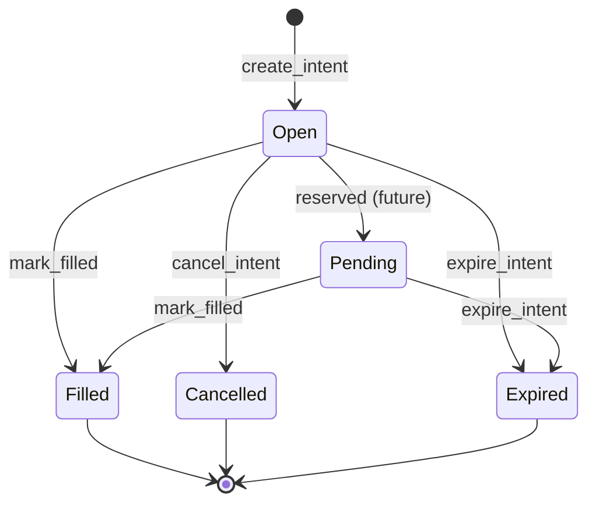

# Intent Lifecycle

Every intent in FluxRoute progresses through a small state machine stored in the
`IntentRegistry` Soroban contract (`contracts/intent-registry/src/lib.rs`). The
registry is a pure state store: it tracks lifecycle status and emits events, but
it never moves tokens. Funds move atomically inside `SolverSettlement`, which
drives the `mark_filled` transition over the cross-contract interface (see
ADR-003).

## State diagram



The label on each arrow is the `IntentRegistry` contract function that drives the
transition. The `Open → Pending` transition has no function yet; it is reserved
for a future solver lock step (see [Pending](#pending)).

## States

| State | Meaning |
| --- | --- |
| **Open** | Initial state. An intent is stored with `status = Open` immediately after `create_intent` succeeds. It can be filled, cancelled, or expired. |
| **Pending** | Reserved. Not currently used; intended for when a solver begins settlement and locks the intent so no one else races it. The registry already accepts `Pending` as a valid source status for `mark_filled` and `expire_intent`, so enabling it later needs no registry change. |
| **Filled** | Terminal. A solver successfully settled the intent; `filled_by` records which solver. |
| **Cancelled** | Terminal. The sender revoked the intent before it was filled. Only reachable from `Open`. |
| **Expired** | Terminal. The deadline ledger passed while the intent was still open/pending. |

## Transition triggers

### `[*] → Open` — `create_intent`

Called on `IntentRegistry`. The contract requires `sender.require_auth()`, a
positive `input_amount`, a non-negative `min_output_amount`, distinct input/output
assets, distinct sender/recipient, and a `deadline` strictly greater than the
current ledger sequence. On success it stores the `Intent` with
`status = Open`, indexes it under the sender, and emits `("INTENT", "CREATED")`
with the new intent id as the event value.

### `Open → Filled` (and `Pending → Filled`) — `mark_filled`

`mark_intent(env, id, solver, gross_output)` is **not** called directly by users.
It is invoked by the `SolverSettlement` contract via `Env::invoke_contract` from
inside `execute_settlement` (`contracts/solver-settlement/src/lib.rs:151`), which
is the sole intended caller. Because soroban-sdk 21 exposes no invoker address,
the entry point is not caller-gated in the registry; trust is established by the
settlement contract, where all token movement happens atomically.

The function requires the current status to be `Open` or `Pending` (otherwise
`IntentNotOpen`) and that the current ledger is still on or before the deadline
(otherwise `IntentExpired`). It sets `status = Filled`, stores `filled_by`, and
emits `("INTENT", "FILLED", id)` with the achieved `gross_output` as the event
value.

### `Open → Cancelled` — `cancel_intent`

Called by the intent `sender` (`require_auth`). Only valid when `status == Open`;
any other status returns `IntentNotOpen`. After the status guard the contract
sets `status = Cancelled` and emits `("INTENT", "CANCELD")` with the intent id.
A filled or expired intent can never be cancelled.

### `Open → Expired` (and `Pending → Expired`) — `expire_intent`

Callable by **anyone** once `env.ledger().sequence() > deadline`. The status must
be `Open` or `Pending`; calling it before the deadline returns `InvalidDeadline`,
and a filled/cancelled intent returns `IntentNotOpen`. On success it sets
`status = Expired` and emits `("INTENT", "EXPIRD")` with the intent id. This is
the cleanup path for intents no solver picked up in time.

### `Open → Pending` — reserved (future)

No contract function drives this today. It is planned for a future "solver
lock" step that marks an intent in-flight so concurrent solvers do not race the
same fill. The registry is already forward-compatible: both `mark_filled` and
`expire_intent` treat `Pending` as a valid source status.

## Events

The registry publishes abbreviated topic names mandated by the indexer
(TASK-14); see `contracts/intent-registry/src/events.rs`.

| Event topics | Driven by | Event value (data) |
| --- | --- | --- |
| `("INTENT", "CREATED")` | `create_intent` | intent id (`u64`) |
| `("INTENT", "FILLED", id)` | `mark_filled` | achieved `gross_output` (`i128`) |
| `("INTENT", "CANCELD")` | `cancel_intent` | intent id (`u64`) |
| `("INTENT", "EXPIRD")` | `expire_intent` | intent id (`u64`) |

Note that `FILLED` is the only event that carries the intent id as a **third
topic segment** (in addition to the value); the other three put the id in the
event value/data.

## Subscribing to intent events over RPC

The snippet below polls `rpc.Server.getEvents` for any event emitted by the
`IntentRegistry` contract whose first topic segment is `INTENT` (i.e. the
`INTENT.*` prefix), advancing a cursor between polls so events are not missed
or re-processed. Soroban event topic segments in `getEvents` filters are
base64-encoded `ScVal` strings; a `"*"` wildcard matches any single segment, and
extra trailing segments on the event are ignored, so `["INTENT", "*"]` matches
all four `INTENT` events including the three-segment `FILLED`.

```ts
import { rpc, xdr } from "@stellar/stellar-sdk";

// IntentRegistry contract ID (C... on the target network).
const REGISTRY_ID = "CDR..."; // replace with the deployed registry ID
const server = new rpc.Server("https://soroban-testnet.stellar.org");

// Encode a Soroban Symbol as the base64 ScVal string the filter expects.
const symbolToB64 = (s: string) =>
  xdr.ScVal.symbol(xdr.ScSymbol.scSymbol(s)).toXDRBase64();

const INTENT = symbolToB64("INTENT");

// Tracks progress across polls. Persist this so polling can resume after restart.
let cursor: string | undefined = undefined;

async function pollIntentEvents(): Promise<void> {
  const resp = await server.getEvents({
    // Omit startLedger once you have a cursor; the cursor takes precedence.
    startLedger: cursor ? 0 : 1,
    cursor,
    filters: [
      {
        type: "contract",
        contractIds: [REGISTRY_ID],
        topics: [[INTENT, "*"]], // INTENT.* prefix match (CREATED/FILLED/CANCELD/EXPIRD)
      },
    ],
    limit: 100,
  });

  for (const ev of resp.results) {
    // ev.topic[0] == INTENT (base64); ev.topic[1] is the action; ev.topic[2]
    // holds the intent id only for FILLED. ev.value carries the intent id
    // (CREATED/CANCELD/EXPIRD) or gross_output (FILLED).
    const action = ev.topic[1]; // base64 ScVal Symbol; decode with xdr.ScVal.fromXDR
    console.log(ev.pagingToken, ev.ledger, ev.contractId, action, ev.value);
  }

  // Advance so the next poll fetches only newer events.
  if (resp.results.length > 0) {
    cursor = resp.results[resp.results.length - 1].pagingToken;
  }
}

// Soroban produces a new ledger roughly every 5s; poll at a similar cadence.
setInterval(pollIntentEvents, 5_000);
```

To branch on the specific action, decode each topic segment back from base64,
e.g. `xdr.ScVal.fromXDR(ev.topic[1], "base64").symbol().toString()`, and dispatch
on `CREATED`, `FILLED`, `CANCELD`, or `EXPIRD`.
